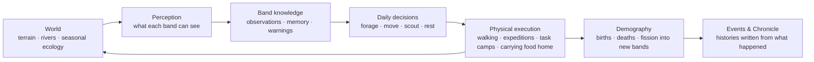
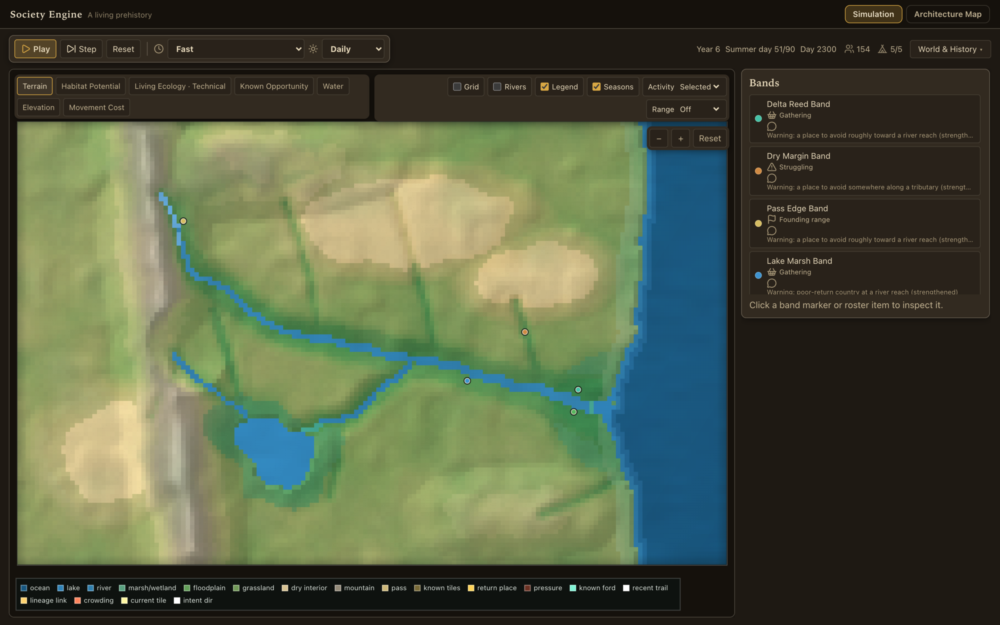

# Society Engine

A deterministic simulation of early human societies, written in TypeScript. Bands of people move through a seasonal world, find food and water, learn and forget places, send out foraging expeditions, grow, split, and build up histories. **None of it is scripted.** Every behaviour has to follow from what a band can physically see, remember, carry and survive.

The long-term goal is to let settlement, culture and social complexity *emerge* from those foundations instead of appearing as unlocks. The current build is the foundation: mobile bands, ecology, knowledge, movement and demography.

[▶ Live demo](https://society-engine.vercel.app) (the interface is an inspection tool, not the product: the work is in `src/sim`)

## Engineering at a glance

- **~140,000 lines of TypeScript** in the simulation core: 165 modules, 128 of them band-level subsystems (mobility, expeditions, crowding, demography, fission, risk, knowledge, chronicles…).
- **Pure core.** `src/sim` has no React or DOM dependency. It runs in a Web Worker in the browser and headless in Node for benchmarks and audits.
- **Deterministic.** All variation comes from a seeded generator, so the same seed and setup always replay the same history. That makes every behaviour reproducible and every bug replayable.
- **Verified by measurement.** 224 audit and diagnostic scripts plus 41 evidence packages, including counterfactual runs (*with* a mechanism minus *without* it) to prove a mechanism actually changes outcomes rather than just existing in the code.

## The hard rule: no omniscience

The central design constraint is that a band may only act on what it could actually know. Decisions read band-local knowledge (what the band observed, remembers or was told), never the true state of the world.

Enforcing that is most of the work. The project has gone through a long series of numbered corrections, each one finding and removing a place where a band could know or affect something it physically couldn't. Some examples:

- Remembered places were counting as *physical crowding*. Memory and presence are now separate.
- A risk calculation read the global number of bands. The function no longer receives the world at all, so the leak is impossible by construction rather than by convention.
- Workers away on expeditions were still counted as present at home. People are now bodies in exactly one place, and headcount is derived (`workers + non-working`), so it cannot drift.

Wherever possible, invariants are made **structural** (the wrong value is unreachable) instead of checked after the fact.

## How a day works



Each simulated day advances ecology, lets bands perceive and update their knowledge, chooses actions from that knowledge only, executes them physically (people walk, carry and return), then applies demography and records events. The Chronicle is generated from those events, not written by hand.

## Code map

```text
src/sim/
  world/        terrain, hydrology, seasonal ecology
  knowledge/    band-local observations and memory
  agents/       band subsystems: mobility, expeditions, crowding, demography, fission…
  tick/         the daily/seasonal advance pipeline
  diagnostics/  read-only probes used by audits
  chronicles/   history generation from simulated events
src/worker/     runs the simulation off the main thread
src/ui/         React + canvas inspection interface
scripts/        headless benchmarks, audits and evidence generators
```

<details>
<summary>Screenshot of the inspection interface</summary>



</details>

## Running it

```bash
npm install
npm run dev        # development server
npm run build      # type check and production build
```

## Benchmark CLI

The simulation can also run without the browser for performance and behavior checks:

```bash
npm run sim:benchmark
```

Scenarios cover crowded deltas, overloaded core areas, daughter-band expansion, dry margins, and other cases. The benchmark script also supports reproducible checks when you want to confirm that the same setup gives the same run.

## Status

Actively developed. The current codebase focuses on making the physical, behavioral, and demographic foundations robust enough for later social complexity to emerge causally rather than be scripted on top.
